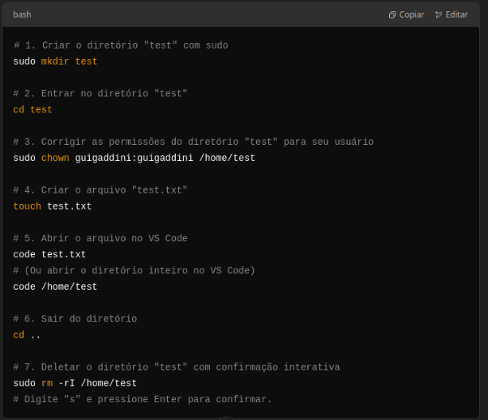

**the odin project | caderno**

Linux
# Aulas Terminal
<https://www.cursoemvideo.com/curso/linux/aulas/comandos-do-terminal-do-linux/>
# Praticando superpoderes de CLI

1. Crie um novo diretório no seu diretório home com o nome "test". 
1. Navegue até o diretório "test". 
1. Crie um novo arquivo chamado "test.txt". Dica: use o comando touch.
1. Abra o arquivo recém-criado no VSCode, faça algumas alterações, salve o arquivo e feche-o. 
1. Navegue de volta para fora do diretório "test". 
1. Delete o diretório "test".

# Glossário de comandos
### **sudo**
- **O que é?**: Significa "Super User DO". Usado para executar comandos com permissões de administrador (root).
### **mkdir**
- **O que é?**: Significa "make directory"
### **cd**
- **O que é?**: Significa "change directory" 
### **rm**
- **O que é?**: Significa "remove" (remover). Usado para excluir arquivos ou diretórios.
- Para excluir um diretório e seu conteúdo, use a opção -r (recursivo). EX:

rm -r diretório
### **touch**
- **O que é?**: Usado para criar arquivos vazios ou atualizar a data de modificação de arquivos existentes.
### **ls**
- **O que é?**: Significa "list". Usado para listar arquivos e pastas no diretório atual.
### **pwd**
- **O que é?**: Significa "print working directory". Mostra o caminho completo do diretório em que você está.
### **clear**
- **O que é?**: Usado para limpar a tela do terminal.

**man**

- **O que é?**: Usado para acessar o manual de qualquer comando.

Git

# Cheatsheet

## Commands related to a remote repository:
**git clone git@github.com:USER-NAME/REPOSITORY-NAME.git**

**git push** ou git **push origin main** (Ambos servem pro mesmo objetivo nesse contexto)
## Commands related to the workflow:
**git add .**

**git commit -m** **"message”** -> A mensagem que você escreve no comando git commit -m "mensagem" deve descrever o que foi alterado, adicionado ou corrigido desde o último snapshot. Essa descrição ajuda você e outras pessoas a entenderem as mudanças feitas no código ao longo do tempo."
## Commands related to checking status or log history
**git status**

**git log**

-> The basic Git syntax is **program | action | destination**. For example:

**git add .** is read as **git | add | .**, where the period represents everything in the current directory;

**git commit -m "message"** is read **as git | commit -m | "message"** *(After typing your commit message, save it Ctrl + S )*; and

**git status** is read as **git | status | (no destination).**

\*preciso entender melhor essa parte de git/github pelo terminal. Sei fazer pelo *GitHub Desktop* porém.

